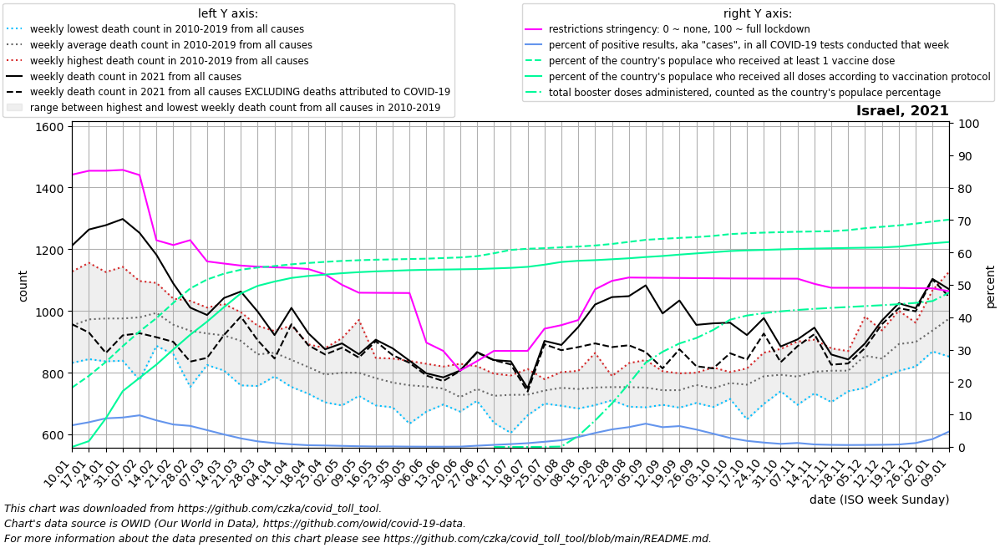
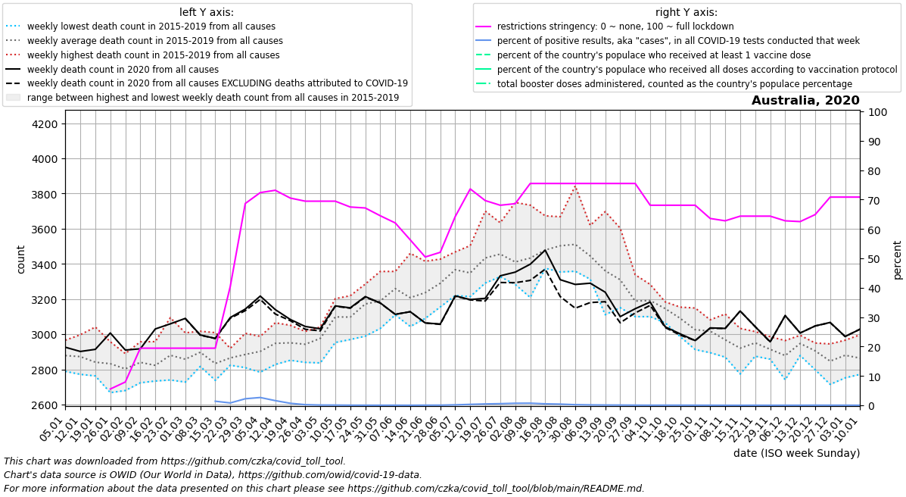

## About the repository

This repository contains a Python script along with PNG charts and CSV datasets it creates, showing all-cause mortality
compared to COVID-19 mortality for a given country and year, in the context of lockdown stringency, vaccinations count,
virus testing, and the country's all-cause mortality in preceding years.

## How to use this

### Browse charts and their datasets, updated once in few weeks:

- To see all charts on a single page click this [CHARTS.md](CHARTS.md) link. I update them every couple of weeks. Here
  are few sample charts from that file:

|Poland 2020   |Israel 2021   |Latvia 2021   |Australia 2020|
|-|-|-|-|
|||||

- To see only a single chart or dataset for a given country and year:

  - Enter directory [covid_toll_ALL](covid_toll_ALL) which contains charts (in PNG format) and data (in CSV format) for
    countries which have had their data in both the
    [excess_mortality.csv](
    https://github.com/owid/covid-19-data/blob/master/public/data/excess_mortality/excess_mortality.csv) and the
    [owid-covid-data.csv](https://github.com/owid/covid-19-data/blob/master/public/data/owid-covid-data.csv).

  - Click on any file. E.g. on the [covid_toll_ALL/Poland_2021.png](covid_toll_ALL/Poland_2021.png) to see the chart for
    Poland in 2021, or the [covid_toll_ALL/Poland_2021.csv](covid_toll_ALL/Poland_2021.csv) to see the chart's input
    data.

### Render most up-to-date charts and datasets yourself:

- Make sure you have `Python` 3.9 or newer with `Pandas` and `matplotlib` libraries installed.

- `git clone` this repository.

- `cd` to a directory where you have cloned it.

- Download these 2 datasets from the [OWID's GitHub repository](https://github.com/owid/covid-19-data) into that same 
  directory: 
  [excess_mortality.csv](https://github.com/owid/covid-19-data/blob/master/public/data/excess_mortality/excess_mortality.csv)
  and [owid-covid-data.csv](https://github.com/owid/covid-19-data/blob/master/public/data/owid-covid-data.csv).

- Run `./covid_toll_tool.py --help` to figure out how to proceed. The final product will be a PNG chart and a CSV 
  dataset for the `--country` and `--year` specified on the command line. E.g. `Poland_2020.png` and `Poland_2020.csv`,
  if `Poland` and `2020` were specified, respectively.

## About the data

All input data are provided by the [Our World in Data (OWID)](https://ourworldindata.org/) project under the
[Creative Commons BY license](https://creativecommons.org/licenses/by/4.0/).

`covid_toll_tool.py` doesn't alter the OWID's data in a meaningful way. It mainly aggregates those that I find most
relevant and combines them on one chart per country/year, for a convenient visual analysis. You can verify the
identity of my charts' data against the original OWID's data using their [Data explorer](
https://ourworldindata.org/explorers/coronavirus-data-explorer?zoomToSelection=true&uniformYAxis=0&pickerSort=asc&pickerMetric=location&Metric=Cases%2C+tests%2C+positive+and+reproduction+rate&Interval=7-day+rolling+average&Relative+to+Population=true&Color+by+test+positivity=false&country=~POL).

The only data presented on `covid_toll_tool.py`'s charts that you won't find directly in OWID's [Data explorer](
https://ourworldindata.org/explorers/coronavirus-data-explorer?zoomToSelection=true&uniformYAxis=0&pickerSort=asc&pickerMetric=location&Metric=Cases%2C+tests%2C+positive+and+reproduction+rate&Interval=7-day+rolling+average&Relative+to+Population=true&Color+by+test+positivity=false&country=~POL)
, but which were derived from those nevertheless, are:

- Death count from all causes **excluding** deaths attributed to COVID-19 (black dashed line). It's calculated as the
all-cause mortality minus the number of deaths attributed to COVID-19. Viewed together with the all-cause mortality
(black solid line) it allows to assess the actual contribution of COVID-19 to country's total mortality in a given
period. This metric should be taken with a grain of salt however, as deaths are commonly attributed to COVID-19
according to COVID-19 test results alone, while the count of positive COVID-19 test results is an artifact of the total
number of tests conducted, which fluctuates in time a lot: [The more tests - the more test results](
https://ourworldindata.org/explorers/coronavirus-data-explorer?zoomToSelection=true&uniformYAxis=0&pickerSort=asc&pickerMetric=location&Metric=Cases%2C+tests%2C+positive+and+reproduction+rate&Interval=7-day+rolling+average&Relative+to+Population=true&Color+by+test+positivity=false&country=~POL),
[the more test results - the more positive test results (aka "cases")](
https://ourworldindata.org/explorers/coronavirus-data-explorer?zoomToSelection=true&uniformYAxis=0&pickerSort=asc&pickerMetric=location&Metric=Cases%2C+tests%2C+positive+and+reproduction+rate&Interval=7-day+rolling+average&Relative+to+Population=true&Color+by+test+positivity=false&country=~POL),
[the more positive test results ("cases") - the more deaths attributed to covid](
https://ourworldindata.org/explorers/coronavirus-data-explorer?zoomToSelection=true&uniformYAxis=0&pickerSort=asc&pickerMetric=location&Metric=Cases+and+deaths&Interval=7-day+rolling+average&Relative+to+Population=true&Color+by+test+positivity=false&country=~POL).

- Percent of people vaccinated in country's populace - partially, fully and booster doses.

OWID obtains their data from official sources like government healthcare agencies and academic institutions. For more
information, please visit their [README on the excess mortality data](
https://github.com/owid/covid-19-data/tree/master/public/data/excess_mortality), [README about the data on COVID-19](
https://github.com/owid/covid-19-data/tree/master/public/data) and the following resources those READMEs refer to:

1. All-cause mortality:
   - [Human Mortality Database Short-term Mortality Fluctuations project](https://www.mortality.org)
   - [World Mortality Dataset](https://github.com/akarlinsky/world_mortality)
2. COVID-19 mortality:
   - [Center for Systems Science and Engineering at Johns Hopkins University](https://github.com/CSSEGISandData/COVID-19)
3. Lockdown stringency index:
   - Hale, T. et al. A global panel database of pandemic policies (Oxford COVID-19 Government Response Tracker). Nature
     Human Behaviour (2021). https://doi.org/10.1038/s41562-021-01079-8
4. Vaccinations:
   - Mathieu, E. et al. A global database of COVID-19 vaccinations. Nature Human Behaviour (2021).
     https://doi.org/10.1038/s41562-021-01122-8
5. Testing:
   - Hasell, J., Mathieu, E., Beltekian, D. et al. A cross-country database of COVID-19 testing. Sci Data 7, 345 (2020).
     https://doi.org/10.1038/s41597-020-00688-8
